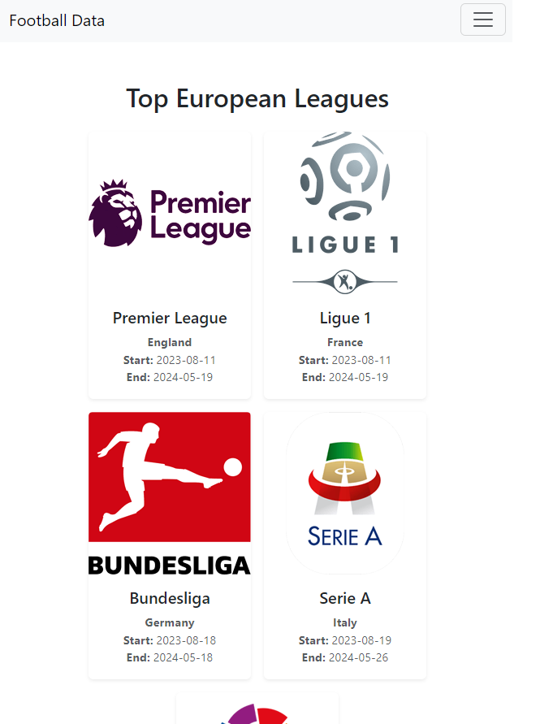
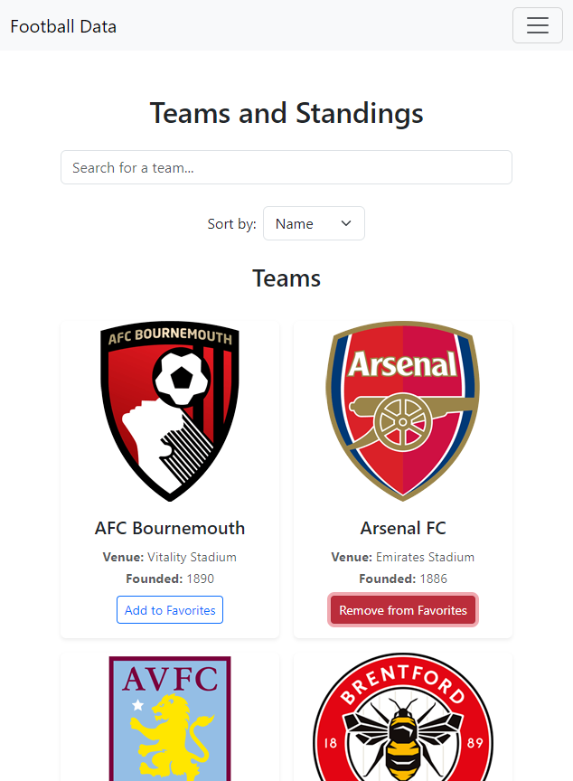
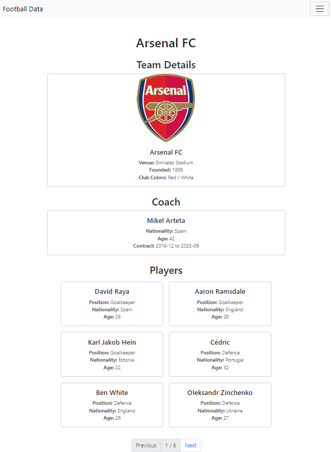
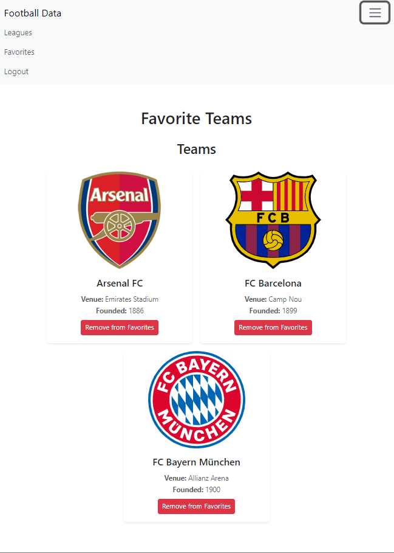
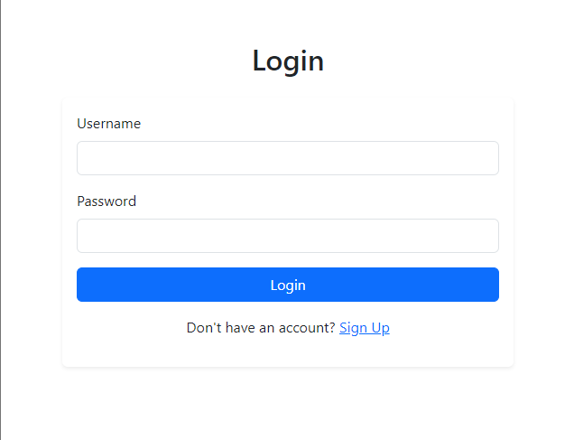
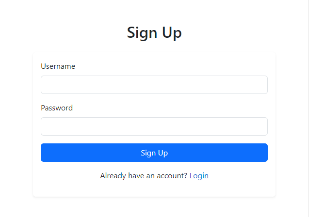

<h3 align="center">
    
    <br><br>
    <b>Football Data</b>  
    <br>
</h3>

## Overview
The football-data application is a comprehensive Vue 3 project designed to provide users with detailed information about European football leagues, teams, and players. It leverages the Football Data API to fetch and display data such as league standings, team details, and player information. The app also includes features for user authentication and the ability to save favorite teams. This project uses Vite for fast development and build processes, along with Pinia for state management and Axios for API requests.

## :heavy_check_mark: :iphone: UI

<h1 align="center">
    
    
</h1>

<h1 align="center">
    
    
</h1>

<h1 align="center">
    
    
</h1>

## Features
- User Authentication: Secure login and signup functionalities using a Node.js backend with SQLite for database management and bcrypt for password hashing.
- League Information: Display detailed information about the top 5 European leagues, including standings, teams, and match schedules.
- Team and Player Details: View comprehensive details about teams and their players, including coach information and squad details.
- Favorites: Logged-in users can save their favorite teams and easily access them.
- Search and Sort: Search for teams and sort them by name or founding year.
- Pagination: Paginate through player lists for better user experience.
- Responsive Design: Optimized for both desktop and mobile devices using Bootstrap for styling.

## Project Structure

```
├── README.md
├── backend
│   ├── package-lock.json
│   ├── package.json
│   └── server.js
└── frontend
    ├── README.md
    ├── cypress
    │   ├── e2e
    │   │   ├── example.cy.ts
    │   │   └── tsconfig.json
    │   ├── fixtures
    │   │   └── example.json
    │   └── support
    │       ├── commands.ts
    │       └── e2e.ts
    ├── cypress.config.ts
    ├── env.d.ts
    ├── index.html
    ├── package-lock.json
    ├── package.json
    ├── public
    │   └── favicon.ico
    ├── src
    │   ├── App.vue
    │   ├── assets
    │   │   ├── base.css
    │   │   ├── logo.svg
    │   │   └── main.css
    │   ├── components
    │   │   ├── CoachDetailsCard.vue
    │   │   ├── LeagueCard.vue
    │   │   ├── LeagueList.vue
    │   │   ├── LoadingSpinner.vue
    │   │   ├── NavBar.vue
    │   │   ├── Pagination.vue
    │   │   ├── PlayerCard.vue
    │   │   ├── StandingItem.vue
    │   │   ├── StandingsSection.vue
    │   │   ├── TeamCard.vue
    │   │   ├── TeamDetailsCard.vue
    │   │   ├── TeamsSection.vue
    │   │   └── __tests__
    │   │       ├── LeagueCard.spec.ts
    │   │       └── Pagination.spec.ts
    │   ├── main.ts
    │   ├── router
    │   │   └── index.ts
    │   ├── services
    │   │   ├── __tests__
    │   │   │   ├── api-service.spec.ts
    │   │   │   ├── auth-service.spec.ts
    │   │   │   └── favorites-service.spec.ts
    │   │   ├── api-service.ts
    │   │   ├── auth-service.ts
    │   │   └── favorites-service.ts
    │   ├── stores
    │   │   └── football-data.ts
    │   ├── types
    │   │   └── football-data.ts
    │   └── views
    │       ├── FavoritesView.vue
    │       ├── LeaguesView.vue
    │       ├── LoginView.vue
    │       ├── SignupView.vue
    │       ├── TeamPlayersView.vue
    │       └── TeamsView.vue
    ├── tsconfig.app.json
    ├── tsconfig.json
    ├── tsconfig.node.json
    ├── tsconfig.vitest.json
    ├── vite.config.ts
    └── vitest.config.ts
```

## API Integration
The application integrates with the Football Data API to fetch information about leagues, teams, standings, and players. The API requests are handled using Axios.

### Node Backend
A Node.js server with Express and SQLite handles user authentication and favorite team management. It provides endpoints for logging in, signing up, and managing favorite teams.

### Backend Endpoints
- POST /login: User login
- POST /signup: User signup
- POST /favorites: Save a favorite team
- DELETE /favorites/:teamId: Remove a favorite team
- GET /favorites: Get favorite teams